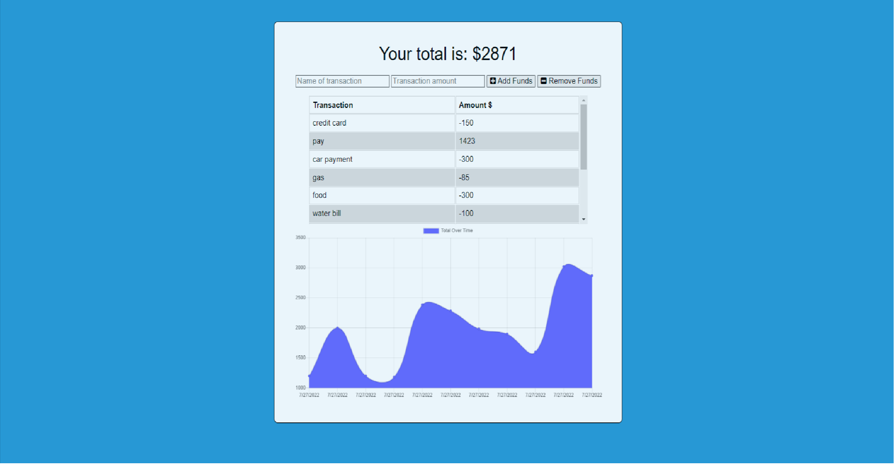

# Budget Tracker (PWA)

## Description

Welcome to Budget Tracker 5000! You can keep track of your incoming monies, and outgoing monies.

## Table of Contents

- [Installation](#installation)
- [Usage](#usage)
- [Example Usage](#example-usage)

## Installation

To install the required dependencies, run `npm install` 
You will also need to signup for a free account at [mongodb.com](https://www.mongodb.com/).

## Usage

To start the server, run `npm start` or `nodemon start` if Nodemon is installed.  To access the app after starting the server, go to http://localhost:3001 in your browser.

## Example Usage

An example screenshot of the application is below.

